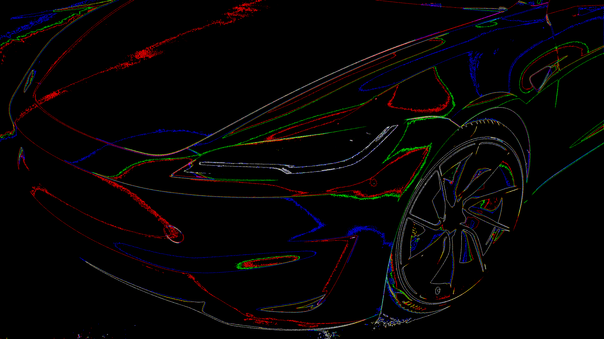
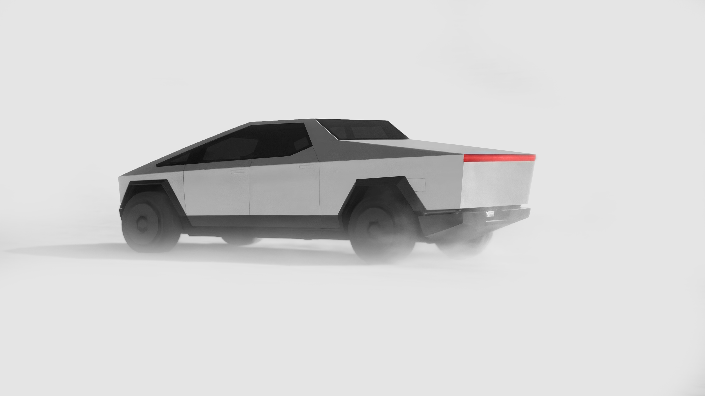

# Wallpapers

Wallpapers made by me, MODIFIED for my own use, or ones I just think are cool. Full credit to the original creators of SOME of these.

## Model 3 Trace Contour

> [!Note]
> *Orignal photos were taken by [Tesla](https://www.tesla.com/). 2024 Model 3 Performance with the Trace Contour effect (Photoshop)... just a random idea. I tried upscaling to 6k, but there were some weird artifacting going on, so they're *4000x2550*.*

[Back \(Color\)](./Model3TraceContour/Model-3-Performance_Back_Color.png) · [Front \(Color\)](./Model3TraceContour/Model-3-Performance_Front_Color.png) · [Side \(Color\)](./Model3TraceContour/Model-3-Performance_Side_Color.png) · [Back \(B&W\)](./Model3TraceContour/Model-3-Performance_Back_BW.png) · [Front \(B&W\)](./Model3TraceContour/Model-3-Performance_Front_BW.png) · [Side \(B&W\)](./Model3TraceContour/Model-3-Performance_Side_BW.png)

## Graffiti Variants

> [!Important]
> *I did not make this! I only switched the colors around in `Lightroom` / `Photoshop` to create these other variants. Credit to [Basic Apple Guy](https://x.com/BasicAppleGuy) and his [orignial](https://basicappleguy.com/haberdashery/graffiti), his content is AMAZING.*

[Red](./GraffitiVariants/Graffiti_C_Mac-Red.jpg) · [Green](./GraffitiVariants/Graffiti_C_Mac-Green.jpg) · [Blue](./GraffitiVariants/Graffiti_C_Mac-Blue.jpg) · [Yellow](./GraffitiVariants/Graffiti_C_Mac-Yellow.png) · [Grey](./GraffitiVariants/Graffiti_C_Mac-Grey.png) · [Black](./GraffitiVariants/Graffiti_C_Mac-Black.jpg)

## Apple Hongdae Variants

> [!Important]
> *I did not design these! Credit to [Apple](https://www.apple.com/kr/). Eight color variations of the Apple Store Hongdae (홍대) wallpapers. The grey brought down to black, and several Lightroom changes to add some variety.*

[Original](./HongdaeVariants/Hongdae-6K-Original.png) · [Red](./HongdaeVariants/Hongdae-6K-Red.png) · [Green](./HongdaeVariants/Hongdae-6K-Green.png) · [Blue](./HongdaeVariants/Hongdae-6K-Blue.png) · [White](./HongdaeVariants/Hongdae-6K-White.png) · [Rotate1](./HongdaeVariants/Hongdae-6K-Rotate1.png) · [Rotate2](./HongdaeVariants/Hongdae-6K-Rotate2.png) · [Hongdae](./HongdaeVariants/Hongdae-6K-Hongdae.png)

## pLan

*Painting used as the banner/background of my fake programming language "brand", pLan. Made by me.*

[Clean](./pLan/pLan-6K-Clean.png) · [Noise](./pLan/pLan-6K-Noise.png)

## Cybertruck Redesign

> [!Note]
> *My photo manipulation and upscaling of a Cybertruck concept from ??? on Reddit. Credit to whoever the guy is for the original modification of Cybertruck.*

